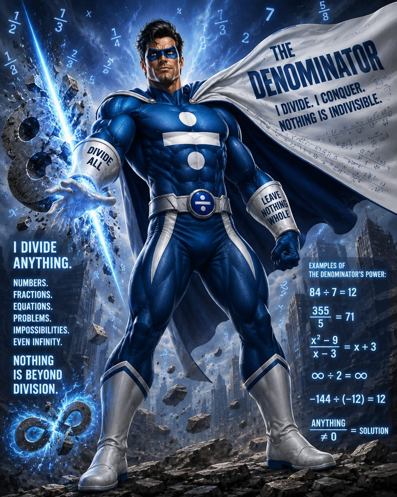

```{=html}
<style>
/* This page runs the Denominator's own blue-and-silver colours rather than
   the site gold. Everything is scoped to .dn- so it can't leak elsewhere. */
.dn-wrap {
  --deep:   #050E1D;
  --navy:   #122645;
  --panel:  #16294A;
  --arc:    #5182CC;
  --arc-lo: #2D5299;
  --silver: #BEC7D3;
  --ice:    #F2F5F9;
}
.dn-hero {
  position: relative; border-radius: 6px; overflow: hidden;
  border: 1px solid var(--arc-lo); background: var(--deep);
  display: flex; gap: 0; flex-wrap: wrap; margin-bottom: 2rem;
}
.dn-hero-art { flex: 1 1 300px; min-width: 260px; }
.dn-hero-art img { display: block; width: 100%; height: 100%; object-fit: cover; }
.dn-hero-body {
  flex: 1 1 340px; padding: 2rem 1.9rem;
  background: linear-gradient(160deg, var(--navy), var(--deep));
  display: flex; flex-direction: column; justify-content: center;
}
.dn-alias {
  color: var(--arc); text-transform: uppercase; font-weight: 700;
  letter-spacing: 2.5px; font-size: 0.72em; margin-bottom: 0.5rem;
}
.dn-name {
  font-size: 2.5rem; font-weight: 800; line-height: 1.02;
  color: var(--ice); margin: 0 0 0.7rem; letter-spacing: -0.01em;
}
.dn-creed {
  color: var(--silver); font-weight: 600; text-transform: uppercase;
  letter-spacing: 1px; font-size: 0.82rem; line-height: 1.7;
  border-left: 3px solid var(--arc); padding-left: 0.9rem; margin: 0 0 1rem;
}
.dn-sub { color: #93A4BC; margin: 0; font-size: 0.95rem; }

.dn-stats {
  display: grid; grid-template-columns: repeat(auto-fit, minmax(158px, 1fr));
  gap: 0.9rem; margin: 1.8rem 0 2rem;
}
.dn-stat {
  background: var(--panel); border: 1px solid #24406E;
  border-left: 3px solid var(--arc); border-radius: 4px; padding: 0.9rem 1rem;
}
.dn-stat .k {
  color: var(--arc); text-transform: uppercase; font-size: 0.68em;
  letter-spacing: 1.2px; font-weight: 700;
}
.dn-stat .v { color: var(--ice); font-size: 1.35rem; font-weight: 800; line-height: 1.25; }
.dn-stat .n { color: #93A4BC; font-size: 0.8rem; }

.dn-wrap h2 { color: var(--arc); border-bottom-color: rgba(81,130,204,0.25); }
.dn-wrap a { color: var(--arc); }
.dn-mark { float: right; width: 96px; margin: 0 0 1rem 1.4rem; }
@media (max-width: 620px) { .dn-name { font-size: 2rem; } }
</style>
```

::: {.dn-wrap}

::: {.dn-hero}
::: {.dn-hero-art}
{fig-alt="The Denominator: a caped figure in blue and silver standing over a ruined city, surrounded by fractions, with a banner reading I divide, I conquer, nothing is indivisible."}
:::

::: {.dn-hero-body}
::: {.dn-alias}
Course Director · MA491
:::
::: {.dn-name}
The Denominator
:::
::: {.dn-creed}
I divide.<br>I conquer.<br>Nothing is indivisible.
:::
::: {.dn-sub}
Dusty Turner. Splits large problems into small ones, and insists on knowing
what every percentage is a percentage *of*.
:::
:::
:::

## Origin story

{.dn-mark fig-alt="The Denominator's chest emblem: a silver shield bearing one over D, split by a glowing electric bar."}

Every hero needs a moment where the ordinary breaks. Mine was a briefing room,
a slide with a single unlabeled percentage on it, and a colonel asking the only
question that mattered: **"Percent of what?"**

Nobody could answer. The numerator was right there in 72-point font. The
denominator had been left behind in a spreadsheet three weeks earlier and
nobody thought to bring it along.

That question is the whole job. A number without its denominator is a rumor
wearing a lab coat. Ninety incidents is a catastrophe out of a hundred and a
rounding error out of a hundred thousand, and the gap between those two
briefings is somebody's decision.

So that's the beat I patrol. Not the flashy estimate — the thing underneath it
that decides whether the estimate means anything at all.

::: {.dn-stats}
::: {.dn-stat}
::: {.k}
Primary power
:::
::: {.v}
"Of what?"
:::
::: {.n}
Effective against any percentage
:::
:::

::: {.dn-stat}
::: {.k}
Secondary power
:::
::: {.v}
Shrinks noise
:::
::: {.n}
Scales with √n
:::
:::

::: {.dn-stat}
::: {.k}
Known weakness
:::
::: {.v}
Zero
:::
::: {.n}
Do not attempt
:::
:::

::: {.dn-stat}
::: {.k}
Sidekick
:::
::: {.v}
R
:::
::: {.n}
Free, and always shows up
:::
:::
:::

## The power, demonstrated

The Denominator's real superpower isn't a metaphor — it's the reason a bigger
sample tells you more. The standard error puts $n$ underneath, so the noise
falls away as the denominator grows:

$$\text{SE} = \frac{s}{\sqrt{n}}$$

```{r}
#| label: the-power
#| message: false

n  <- c(10, 40, 160, 640, 2560)
se <- 1.6 / sqrt(n)

data.frame(
  n              = n,
  standard_error = round(se, 4),
  vs_n_10        = paste0(round(se / se[1] * 100), "%")
)
```

Quadruple the denominator, halve the error. No cape required — just a bigger
$n$ and the patience to go collect it.

::: {.callout-important}
## The one rule
The denominator may be large. The denominator may be inconvenient. The
denominator may be genuinely hard to pin down. The denominator may **not** be
zero. Nothing is indivisible — except by that.
:::

## Where to find me

| | |
|---|---|
| **Role** | Course Director, MA491 |
| **Email** | [dusty.turner@westpoint.edu](mailto:dusty.turner@westpoint.edu) |
| **Office** | *TBD* |
| **Office hours** | *TBD* |

Come by early rather than the night before something is due. Bring your
denominator.

:::
