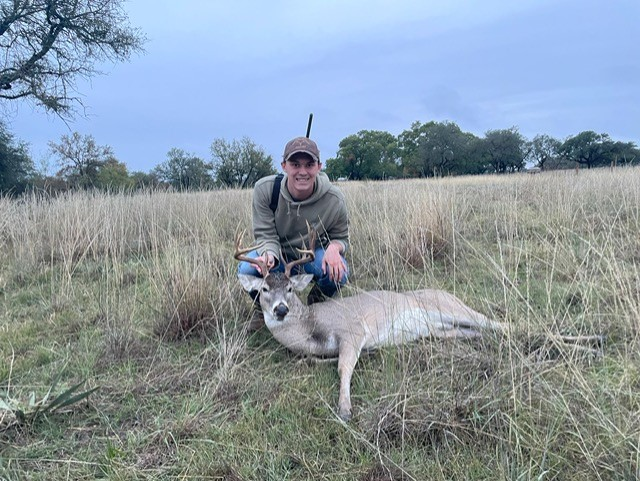
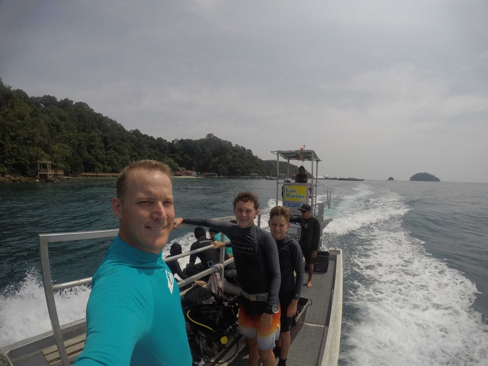
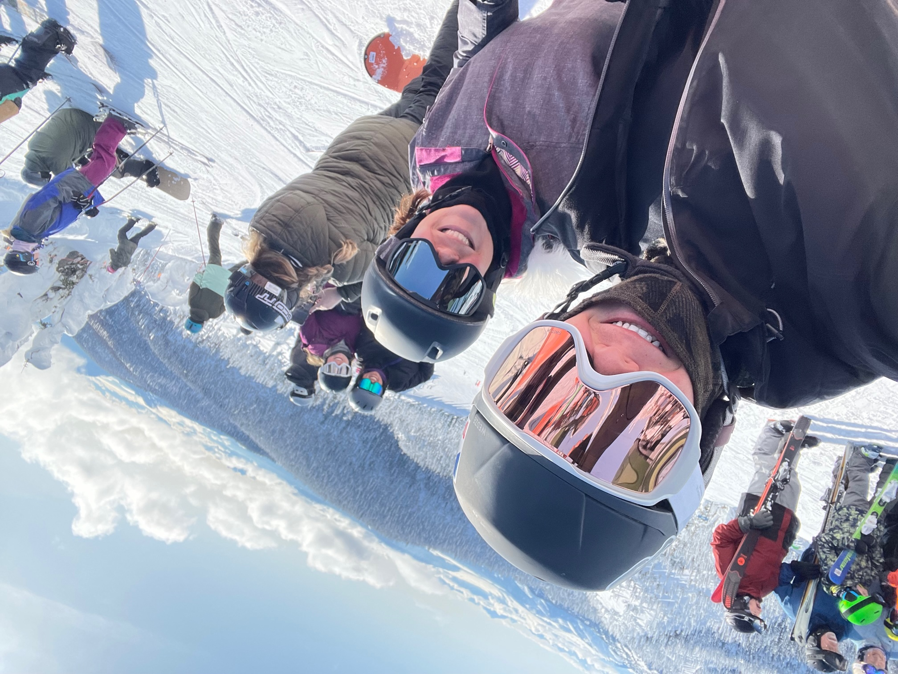
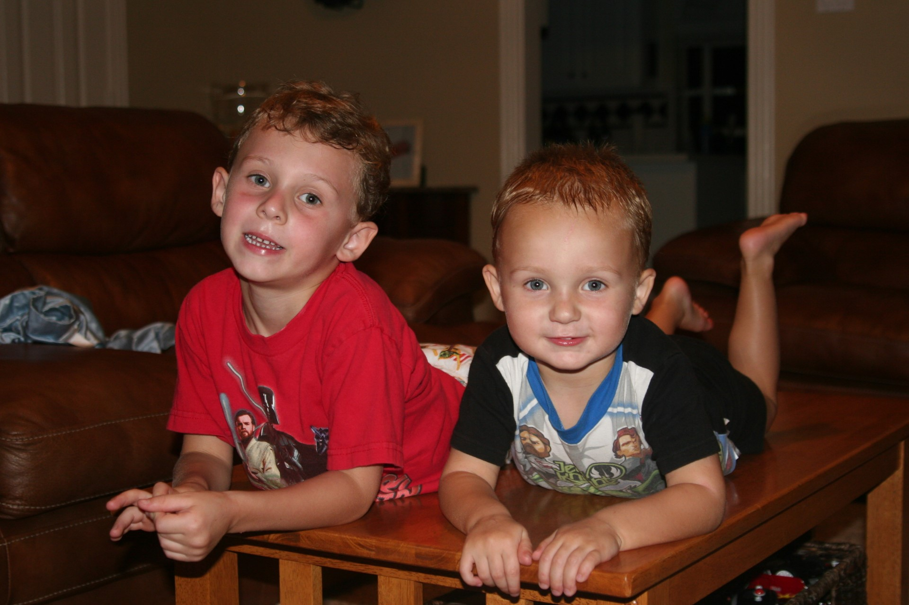

::: {.lesson-meta}
**Office:** TBD &nbsp;&middot;&nbsp; **Email:** TBD
:::

## About

I spent seven years growing up abroad, living in both France and Singapore,
which shaped a pretty strong pull toward travel and being outside. When I'm
not working, I'm usually trying to be in the mountains, the woods, or the
water &mdash; hunting, skiing, wakesurfing, scuba diving, or just being in
nature.

## Family

I have two parents and one younger brother, who's currently a student at
UT Austin.

## Photos

::: {layout-ncol="2"}

:::

## Office hours

| Day | Time |
|---|---|
| TBD | TBD |
